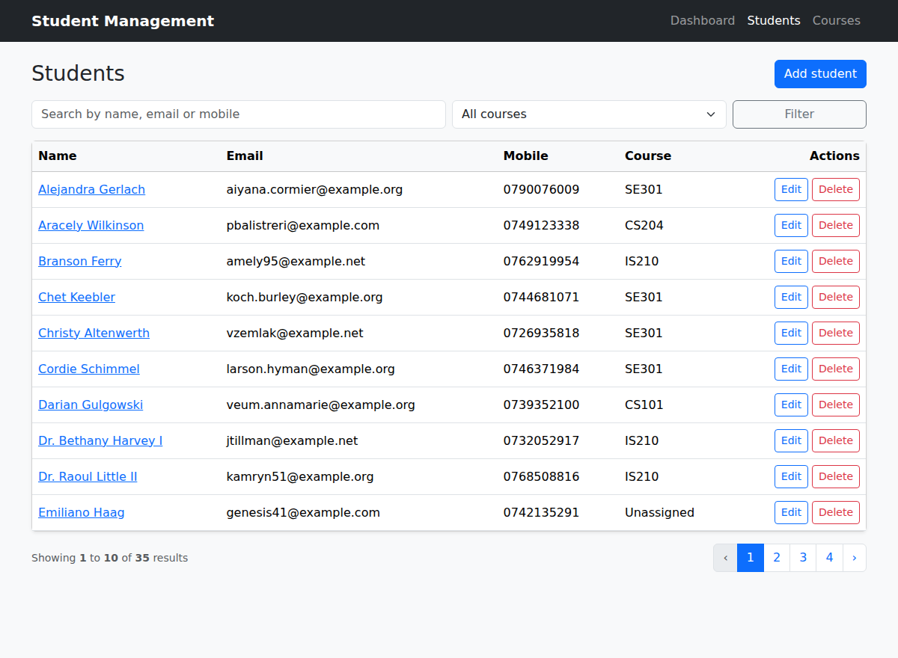
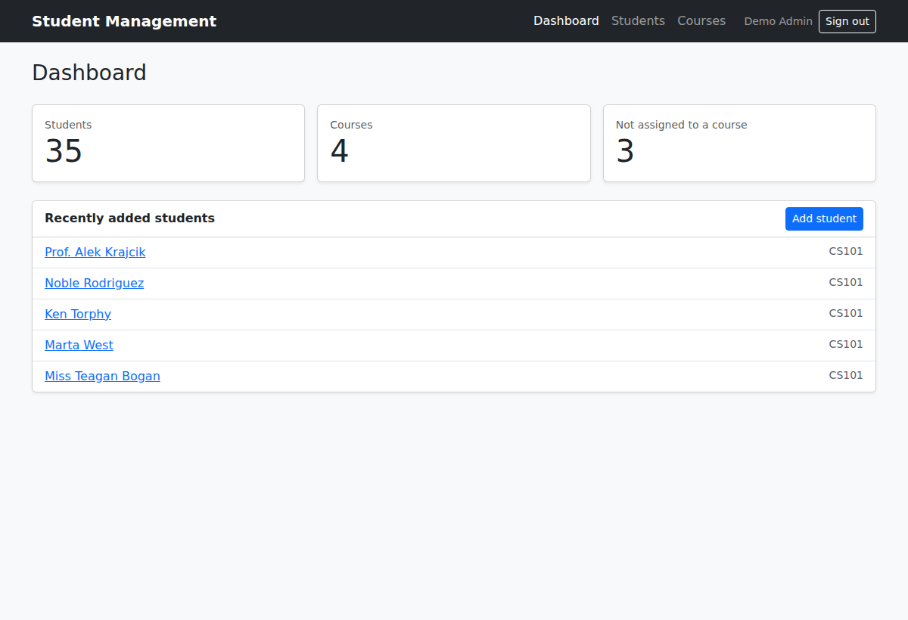
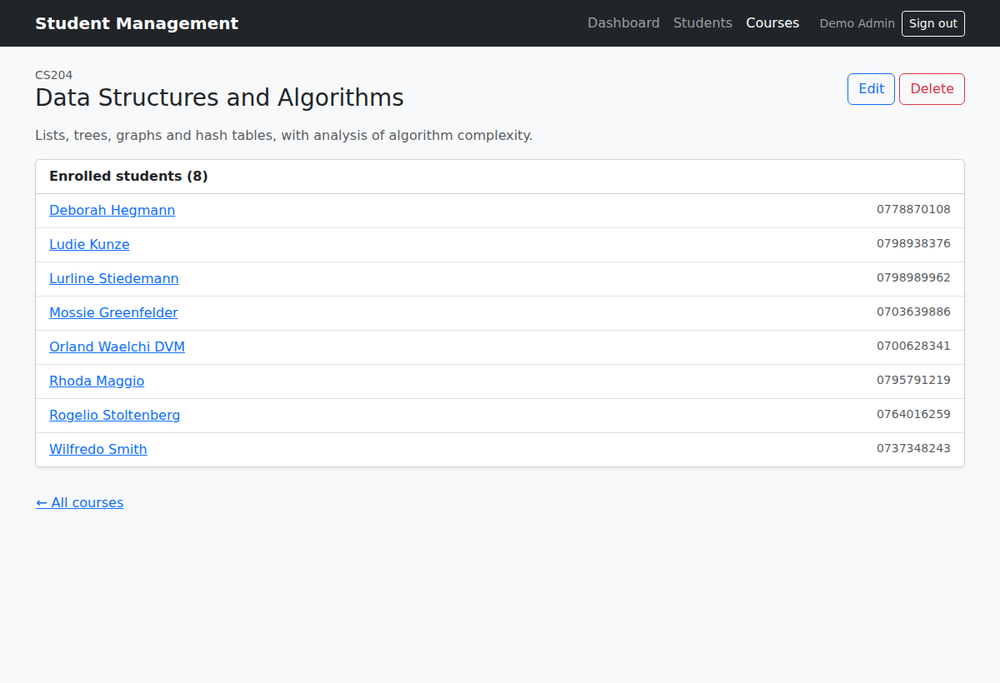
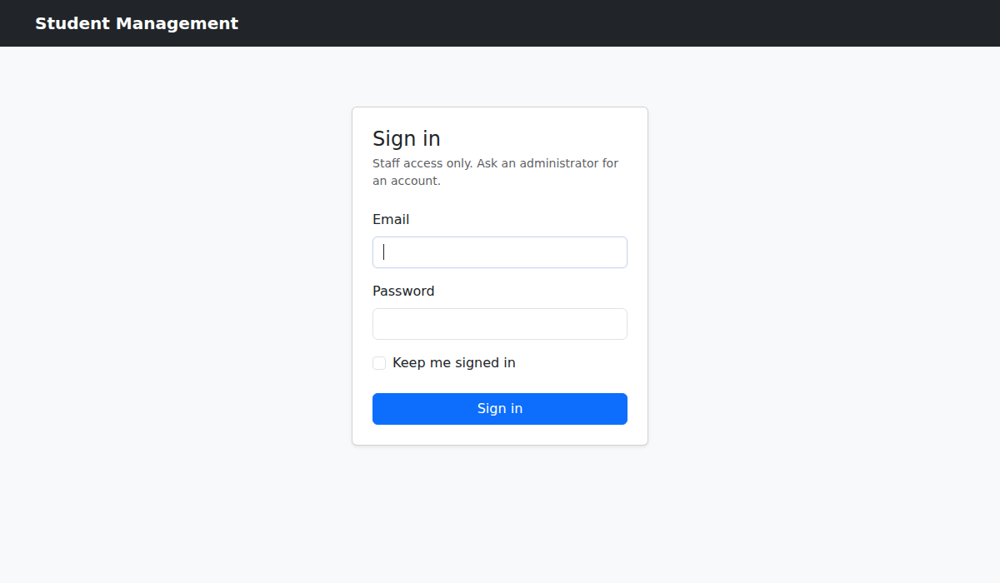

# Student Management System

A Laravel application for managing students and the courses they're enrolled in. Staff sign in to reach searchable, paginated student records and course management with enrolment counts. Input is validated on the server, and a feature-test suite runs in CI on every push.


[](https://github.com/OHURU-IAN/student-management-system/actions/workflows/tests.yml)



## Features

- **Sign in:** every page requires a staff login. Accounts are invite-only and created with `php artisan user:create`; there's no public registration. Failed logins are rate-limited (5 attempts per email and IP), the session ID is regenerated on sign-in to prevent session fixation, and there's an optional "keep me signed in". After signing in, you're sent to the page you originally asked for.
- **Students:** create, view, edit and delete student records (name, email, address, mobile, course).
- **Search and filter:** search by name, email or mobile, filter by course, and page through results 10 at a time. The query string is kept across pages.
- **Courses:** create, view, edit and delete courses. The list shows how many students are enrolled, and each course page lists its students.
- **Relationships:** `Student belongsTo Course` and `Course hasMany Student`. Deleting a course leaves its students on record as *unassigned* (the foreign key uses `nullOnDelete`) instead of deleting them.
- **Validation:** Form Request classes check required fields, email format and uniqueness (ignoring the current record on update), phone number format, and that the chosen course exists. Course codes are normalised to upper case, so uniqueness ignores case.
- **Dashboard:** totals for students, courses and unassigned students, plus the most recently added students.

| Dashboard | Course detail |
| --- | --- |
|  |  |

## Architecture

```
app/
├── Console/Commands/CreateUser.php  php artisan user:create
├── Http/Controllers/
│   ├── Auth/AuthenticatedSessionController.php  Sign in and sign out
│   ├── DashboardController.php   Single-action controller for /
│   ├── StudentController.php     Resource controller (7 REST actions)
│   └── CourseController.php      Resource controller (7 REST actions)
├── Http/Requests/
│   ├── LoginRequest.php          Credential check and rate limiting
│   ├── StudentRequest.php        Validation for create and update
│   └── CourseRequest.php         Validation plus code normalisation
└── Models/
    ├── Student.php               belongsTo Course, search() query scope
    └── Course.php                hasMany Student
database/
├── migrations/                   students, courses, and email + course_id on students
├── factories/                    Student and Course factories
└── seeders/DatabaseSeeder.php    4 courses and 35 students of sample data
resources/views/
├── layout.blade.php              Bootstrap 5 shell, navigation, user menu and flash messages
├── auth/login.blade.php
├── dashboard.blade.php
├── students/                     index, show, create, edit, shared _form
├── courses/                      index, show, create, edit, shared _form
└── partials/delete-button.blade.php
tests/Feature/                    AuthenticationTest, StudentTest, CourseTest
```

Routes (`routes/web.php`):

```php
Route::middleware('guest')->group(function () {
    Route::get('login', [AuthenticatedSessionController::class, 'create'])->name('login');
    Route::post('login', [AuthenticatedSessionController::class, 'store']);
});

Route::middleware('auth')->group(function () {
    Route::get('/', DashboardController::class)->name('dashboard');
    Route::resource('students', StudentController::class);
    Route::resource('courses', CourseController::class);
    Route::post('logout', [AuthenticatedSessionController::class, 'destroy'])->name('logout');
});
```

## Getting started

Requirements: PHP 8.2+ (with `pdo_sqlite`) and Composer.

```bash
composer install
cp .env.example .env              # SQLite by default
touch database/database.sqlite
php artisan key:generate
php artisan migrate --seed        # sample courses and students
php artisan serve                 # http://localhost:8000
```

### Signing in

With `APP_ENV=local` (the default in `.env.example`), the seeder creates a demo account:

| Email | Password |
| --- | --- |
| `admin@example.com` | `password` |

The demo account is never created in other environments. To create real staff accounts, run:

```bash
php artisan user:create           # prompts for name, email and password (min. 8 characters)
```



To use MySQL instead, set `DB_CONNECTION=mysql` and the `DB_*` credentials in `.env`, then run `php artisan migrate --seed`.

## Testing

```bash
php artisan test          # 40 feature tests on an in-memory SQLite database
vendor/bin/pint --test    # code style (Laravel preset)
```

The tests cover sign-in, sign-out, rate limiting, redirects for guests on every protected route, the `user:create` command, every resource action, search, course filtering, pagination, validation (including unique email and course code on create and update), 404 handling, and keeping students when their course is deleted.
GitHub Actions runs both commands on PHP 8.2, 8.3 and 8.4 for every push and pull request.

## Possible extensions

- Roles (for example, read-only staff and administrators) and password reset by email
- Many-to-many enrolments with grades per course
- CSV import and export of student records
